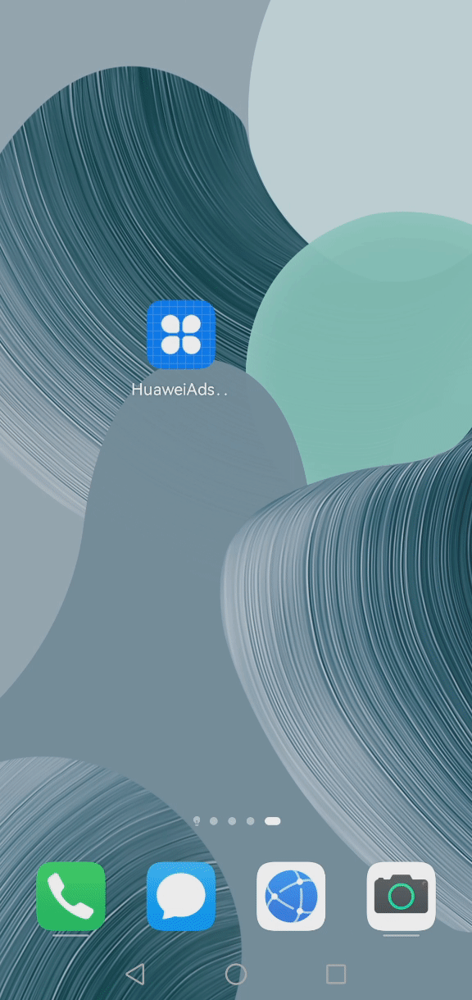

# Petal Ads HarmonyOS Sample Code (Java)
English | [中文](README_ZH.md)
## Contents

 * [Introduction](#Introduction)
 * [Installation](#Installation)
 * [Configuration](#Configuration)
 * [Environment Requirements](#Environment-Requirements)
 * [Sample Code](#Sample-Code)
 * [Result](#Result)
 * [License](#License)

## Introduction
The Java sample code provided by Petal Ads Kit describes how to display ads by integrating the Petal Ads Ohos SDK into your HarmonyOS app.

## Installation
Install the sample code on a phone running HarmonyOS.

## Configuration
No configuration is required.

## Environment Requirements
Your phone runs HarmonyOS and has HMS Core (APK) 6.2.0.300 or later installed.

## Sample Code
The Java sample code provided by Petal Ads integrates the Petal Ads Ohos SDK, which offers a range of ad formats including banner, native, rewarded, interstitial, splash, and roll ads. The sample code contains the following files for you to load and display ads and obtain user consent:

1). BannerAbility.java
Used to load and display banner ads.
 Storage path: entry\src\main\java\com\huawei\hms\ads\ohos\sdk\BannerAbility.java 
    
2). NativeAbility.java
Used to load and display native ads.
 Storage path: entry\src\main\java\com\huawei\hms\ads\ohos\sdk\NativeAbility.java 
    
3). RewardAbility.java
Used to load and display rewarded ads.
 Storage path: entry\src\main\java\com\huawei\hms\ads\ohos\sdk\RewardAbility.java 
	
4). InterstitialAbility.java
Used to load and display interstitial ads.
 Storage path: entry\src\main\java\com\huawei\hms\ads\ohos\sdk\InterstitialAbility.java 
	
5). SplashAbility.java
Used to load and display splash ads.
 Storage path: entry\src\main\java\com\huawei\hms\ads\ohos\sdk\SplashAbility.java 
	
6). InstreamAbility.java
Used to load and display roll ads.
 Storage path: entry\src\main\java\com\huawei\hms\ads\ohos\sdk\InstreamAbility.java 

## Result
Banner Ads&emsp;&emsp;&emsp;&emsp;&emsp;&emsp;&emsp;&ensp; Interstitial Ads&emsp;&emsp;&emsp;&emsp;&emsp;&emsp;&ensp; Native Ads

     

Reward Ads&emsp;&emsp;&emsp;&emsp;&emsp;&emsp;&emsp;&ensp; Instream Ads&emsp;&emsp;&emsp;&emsp;&emsp;&emsp;&ensp; Splash Ads

    

## Technical Support
You can visit the [Reddit community](https://www.reddit.com/r/HuaweiDevelopers/) to obtain the latest information about HMS Core and communicate with other developers.

If you have any questions about the sample code, try the following:
- Visit [Stack Overflow](https://stackoverflow.com/questions/tagged/huawei-mobile-services?tab=Votes), submit your questions, and tag them with `huawei-mobile-services`. Huawei experts will answer your questions.
- Visit the HMS Core section in the [Huawei Developer Forum](https://forums.developer.huawei.com/forumPortal/en/home?fid=0101187876626530001) and communicate with other developers.

If you encounter any issues when using the sample code, submit your [issues](https://github.com/HMS-Core/hms-ads-demo-harmonyos/issues) or submit a [pull request](https://github.com/HMS-Core/hms-ads-demo-harmonyos/pulls).

##  License
The sample code is licensed under [Apache License 2.0](http://www.apache.org/licenses/LICENSE-2.0).
