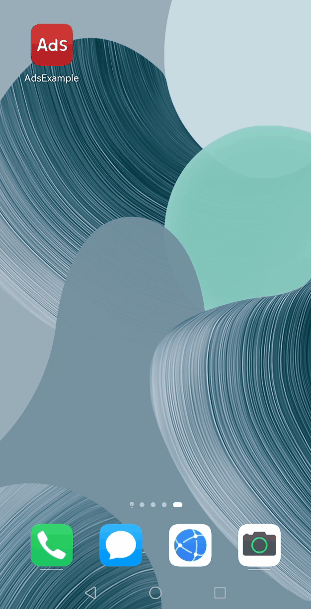

# 华为广告服务JavaScript示例代码
中文 | [English](README.md)
## 目录

 * [简介](#简介)
 * [安装](#安装)
 * [配置](#配置)
 * [环境要求](#环境要求)
 * [示例代码](#示例代码)
 * [运行结果](#运行结果)
 * [授权许可](#授权许可)

## 简介
harmony-ads-js-demo 示例代码向您介绍如何将 HaromnyOS  Ads JS API 集成到JS FA页面中，实现广告展示。

## 安装
在华为手机上安装该示例代码项目。

## 配置
无需配置。

## 环境要求
在华为手机上安装HMS Core (APK) 6.1.0及以上版本。

## 示例代码
harmony-ads-js-demo 示例代码集成了 HaromnyOS  Ads JS API，为您提供横幅广告、原生广告、激励广告、插屏广告的展示页面。本示例代码包括以下四个JS FA页面，便于您进行广告加载、展示：

1). banner.hml
用于加载、展示横幅广告。
 代码位置：enty\src\main\js\default\pages\banner\banner.hm 
    
2). native.hml
用于加载、展示原生广告。
 代码位置：enty\src\main\js\default\pages\native\native.hml 
    
3). reward.hml
用于加载、展示激励广告。
 代码位置：enty\src\main\js\default\pages\reward\reward.hml 
	
4). interstitial.hml
用于加载、展示插屏广告。
 代码位置： enty\src\main\js\default\pages\interstitial\interstitial.hml 

## 运行结果
Banner Ads&emsp;&emsp;&emsp;&emsp;&emsp;&emsp;&emsp;&ensp; Interstitial Ads&emsp;&emsp;&emsp;&emsp;&emsp;&emsp;&ensp; Native Ads

     

Reward Ads&emsp;&emsp;&emsp;&emsp;&emsp;&emsp;&emsp;&ensp; 

 

## 技术支持
如果您对HMS Core还处于评估阶段，可在[Reddit社区](https://www.reddit.com/r/HuaweiDevelopers/)获取关于HMS Core的最新讯息，并与其他开发者交流见解。

如果您对使用HMS示例代码有疑问，请尝试：
- 开发过程遇到问题上[Stack Overflow](https://stackoverflow.com/questions/tagged/huawei-mobile-services?tab=Votes)，在`huawei-mobile-services`标签下提问，有华为研发专家在线一对一解决您的问题。
- 到[华为开发者论坛](https://forums.developer.huawei.com/forumPortal/en/home?fid=0101187876626530001) HMS Core板块与其他开发者进行交流。

如果您在尝试示例代码中遇到问题，请向仓库提交[issue](https://github.com/HMS-Core/hms-ads-demo-harmonyos/issues)，也欢迎您提交[Pull Request](https://github.com/HMS-Core/hms-ads-demo-harmonyos/pulls)。

##  授权许可
华为广告服务JavaScript示例代码经过 [Apache License, version 2.0](http://www.apache.org/licenses/LICENSE-2.0)授权许可。

